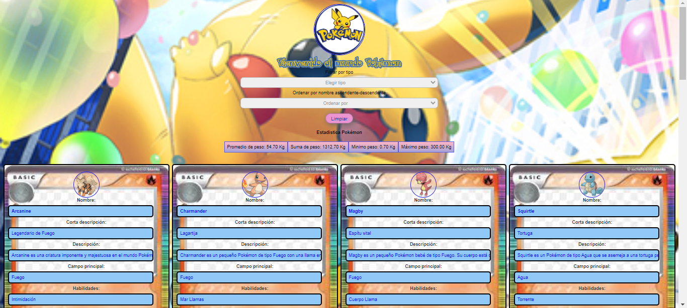

# Dataverse
README:

# Dataverse 

## Introducción

¡Bienvenido a Data Lovers! La aplicación web esta diseñada para todos los amantes de Pokémon. Con Data Lovers, puedes adentrarte en el fascinante mundo de los Pokémon y explorar información detallada sobre estas criaturas icónicas. Hemos desarrollado esta aplicación con el propósito de brindarte una experiencia enriquecedora y divertida.

## Funcionalidades

Data Lovers te ofrece una variedad de funcionalidades útiles para explorar y aprender más sobre tus Pokémon favoritos:

1. **Filtrar Pokémon por tipo**: Nuestra aplicación te permite seleccionar un tipo de Pokémon específico, como Agua, Fuego, Dragón y muchos otros, para ver una lista de Pokémon relacionados con ese tipo.

2. **Ordenar Pokémon**: Puedes ordenar la lista de Pokémon de acuerdo con tus preferencias. Elige entre criterios de ordenación como el nombre en orden alfabético ascendente o en orden descendente.

3. **Estadísticas Pokémon**: En Data Lovers, proporcionamos estadísticas útiles que te ayudarán a comprender mejor a los Pokémon. Puedes acceder a datos como el promedio de peso, la suma total de pesos, el peso mínimo y máximo en la lista seleccionada.

## Cómo usar la aplicación

Utilizar Data Lovers es fácil y divertido. Aquí hay algunos pasos para ayudarte a aprovechar al máximo nuestra aplicación:

1. **Filtrado por Tipo**: En la parte superior de la página, encontrarás un menú desplegable que te permite seleccionar un tipo de Pokémon de tu elección. Una vez que lo elijas, la lista de Pokémon se actualizará automáticamente para mostrar solo los de ese tipo.

2. **Ordenación Personalizada**: En el segundo menú desplegable, puedes seleccionar tu criterio de ordenación preferido. Esto te permitirá organizar la lista de Pokémon por nombre de manera ascendente o descendente.

3. **Limpiar Selecciones**: Si en cualquier momento deseas volver a la lista completa de Pokémon, simplemente haz clic en el botón "Limpiar" y restaurarás la vista general.

4. **Estadísticas Detalladas**: Mientras exploras la lista de Pokémon, observarás una sección llamada "Estadística Pokémon". Aquí, puedes obtener información útil sobre las estadísticas de los Pokémon en la lista actual.

## Pasos que Seguimos

Nuestro proceso de desarrollo fue meticuloso y cuidadosamente planificado para garantizar que nuestra aplicación fuera de alta calidad y cumpliera con nuestros objetivos. Aquí están los pasos clave que seguimos:

1. **Definición del Tema**: Iniciamos el proyecto seleccionando el tema central, que, en este caso, fue Pokémon.

2. **Prototipo de Alta Fidelidad**: Creamos un prototipo detallado y de alta fidelidad utilizando la herramienta Figma. Durante esta etapa, también definimos los tipos de Pokémon que se incluirían en nuestra aplicación.

3. **Desarrollo de Código**: Comenzamos la implementación de la aplicación desarrollando la estructura HTML y el archivo view.js. El archivo view.js desempeñó un papel crucial ya que dinamizó gran parte de la interfaz.

4. **Implementación de Funcionalidades**: Agregamos las funcionalidades principales, como los filtros, las opciones de ordenación y un botón de limpieza para una experiencia de usuario más sencilla.

5. **Estilización (CSS)**: Dedicamos tiempo a la estilización de la aplicación, refinando el diseño a través de múltiples iteraciones de CSS hasta alcanzar un resultado que nos satisfizo.

6. **Funcionalidades Finales**: Introdujimos las últimas características para mejorar la experiencia del usuario y cumplir con nuestros objetivos.

7. **Pruebas Unitarias**: Realizamos pruebas unitarias exhaustivas para garantizar que cada componente funcionara correctamente y que no hubiera errores en el código.

8. **Pruebas de Aceptación (OA)**: Luego de superar las pruebas unitarias, ejecutamos pruebas de aceptación para confirmar que nuestro proyecto se alineara con los requisitos definidos previamente.

9. **Corrección de Errores**: Identificamos y corregimos cualquier error que surgió durante las pruebas de aceptación, asegurando que nuestra aplicación estuviera lista para su lanzamiento.

10. **Pruebas e2e**: Realizamos las pruebas e2e para validar internamente el funcionamiento de la aplicación.

## Tecnología utilizada

Hemos construido esta aplicación utilizando HTML, CSS y JavaScript. También incorporamos datos reales de Pokémon para brindarte una experiencia auténtica y enriquecedora.

## Autoras

- Hilda García
- Yamileth Caldera

Esperamos que disfrutes explorando el mundo de los Pokémon con nuestra aplicación. Diviértete, sigue atrapando Pokémon y comparte esta experiencia con tus amigos y compañeros entrenadores.
